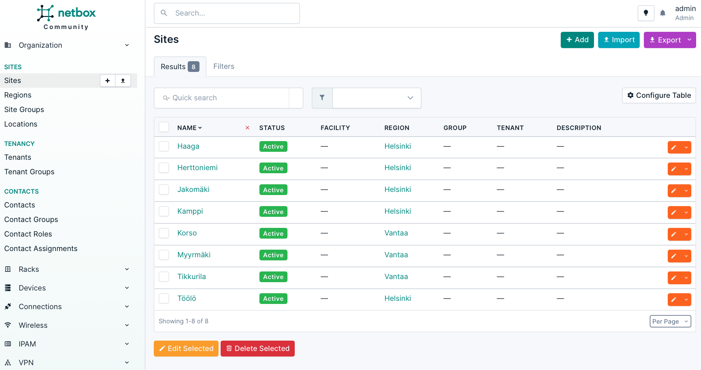

# Netbox Ninja Plugin Examples

This document provides practical examples of using the Netbox Ninja Plugin.

## Sites in a Region Visualization

Assume we have the following sites in Netbox:



### Step 1: Create a Draw.io Diagram

Let's draw a simple picture with [draw.io](https://www.drawio.com):


### Step 2: Add Dynamic Content

After saving the drawing, we'll get a draw.io format XML file. We can make the drawing dynamic by adding Netbox data and logic to it by using Jinja notation:

```xml
<mxfile host="Electron" agent="Mozilla/5.0 (Macintosh; Intel Mac OS X 10_15_7) AppleWebKit/537.36 (KHTML, like Gecko) draw.io/26.2.2 Chrome/134.0.6998.178 Electron/35.1.2 Safari/537.36" version="26.2.2">
  <diagram name="Page-1" id="nSQkXgtPt4yLN-CesYIH">
    <mxGraphModel dx="803" dy="932" grid="1" gridSize="10" guides="1" tooltips="1" connect="1" arrows="1" fold="1" page="1" pageScale="1" pageWidth="850" pageHeight="1100" math="0" shadow="0">
      <root>
        <mxCell id="0" />
        <mxCell id="1" parent="0" />
        <mxCell id="region-{{ target_object.pk }}" value="{{ target_object.name }}" style="rounded=0;whiteSpace=wrap;html=1;" vertex="1" parent="1">
          <mxGeometry x="{{ 270 + (sites.filter(region_id=target_object.pk)|length - 1) / 2 * 200 }}" y="160" width="120" height="60" as="geometry" />
        </mxCell>
        
        <mxCell id="site-{{ site.pk }}" value="{{ site.name }}" style="rounded=0;whiteSpace=wrap;html=1;" vertex="1" parent="1">
          <mxGeometry x="{{ 270 + loop.index0 * 200 }}" y="280" width="120" height="60" as="geometry" />
        </mxCell>
        <mxCell id="line-{{ site.pk }}" style="edgeStyle=orthogonalEdgeStyle;rounded=0;orthogonalLoop=1;jettySize=auto;html=1;exitX=0.5;exitY=1;exitDx=0;exitDy=0;entryX=0.5;entryY=0;entryDx=0;entryDy=0;" edge="1" parent="1" source="region-{{ target_object.pk }}" target="site-{{ site.pk }}">
          <mxGeometry relative="1" as="geometry" />
        </mxCell>
        
      </root>
    </mxGraphModel>
  </diagram>
</mxfile>
```

### Step 3: Create a Ninja Template

Navigate to NetBox's Ninja Templates section and create a new template:


The template creation form includes the following fields:

* **Name**: Name for this Ninja template
* **Output type**: Either render the template to text output or Draw.io format picture
* **Object types**: Assign this template to zero or more Netbox objects. Selected object views will get a new "Ninja" tab where the output is rendered
* **Tags**: Add normal Netbox tags to this template
* **Code**: Add your template code here


### Step 4: View the Template

After creating the template, you'll see the created template:


### Step 5: Object-Specific Templates

You can view object-specific template by opening any Region object in Netbox. In this case, Helsinki:


The drawing is created dynamically for every region. You can add or delete sites from the region and the drawing updates automatically each time the page is opened.
