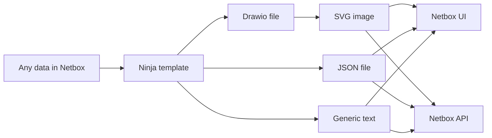

# Netbox Ninja Plugin


[](https://github.com/rautanen-io/netbox-ninja-plugin)

A NetBox plugin for generating dynamic text files and images using Jinja2 templates.

## Overview

Netbox Ninja Plugin enables dynamic content generation in NetBox through Jinja2 templates. It supports both text file generation and SVG image creation from draw.io XML templates, seamlessly integrating with NetBox's data model.


Output files can be seen via Netbox UI and accessed via API.

See video introduction in [Youtube](https://youtu.be/yTFBYkSDgWY?si=YAkBmPFcv_doXWgH).

> **Note**: This plugin is currently in beta. While it's functional, some features are still under development and the API may change in future releases.

## Use cases
Netbox Ninja Plugin can be used to generate **always up-to-date** outputs for many use cases including (but not limited to) following:
- Network diagrams
- Any other visualization of any Netbox data
- Configuration files for others systems to fetch from Netbox
- Any other text based output for any purpose

## Key Features

- Dynamic text file generation using Jinja2 templates
- Template-based SVG image generation from draw.io XML format
- Direct integration with NetBox's data model
- REST API endpoints for template management
- Support for object-specific template rendering
  - Show output in Ninja tab in chosen Netbox object view (i.e. Site)
  - Tempalate rendered per object (i.e for each Site)

## Requirements

- NetBox v4.2.7 or later
- [drawio-export-api](https://github.com/rautanen-io/drawio-export-api) Docker container. Optional, required for SVG images that need to be fetched through REST API.

## Quick Start

1. Install the plugin:
```bash
pip install netbox-ninja-plugin
```

2. Add to NetBox configuration:
```python
PLUGINS = [
    'netbox_ninja_plugin',
]
```

3. Configure the plugin (see [CONFIGURATION.md](CONFIGURATION.md) for detailed options):
```python
PLUGINS_CONFIG = {
    "netbox_ninja_plugin": {
        "target_models": {
            "dcim": ["device", "interface", "site", "region"],
            "ipam": ["prefix"],
        },
        "jinja_model_querysets": {
            "dcim": ["device", "interface", "site", "region"],
            "ipam": ["prefix"],
        },
        "drawio_export_api": {
            "enabled": True,
            "url": "https://drawio-export-api:443/svg",
            "token": "your-token",
            "pem_file_path": "/path/to/drawio_export_api.pem",
            "verify_tls": True,
            "timeout": 60,
        },
    }
}
```

## Usage

### Template Creation

1. Navigate to NetBox's Ninja Templates section
2. Create a new template with:
   - Name: Template identifier
   - Output type: Text or Draw.io format
   - Object types: NetBox objects to associate with the template
   - Template code: Your Jinja2 template

### Template Variables

- Access NetBox objects using object queries, e.g. `{{ sites.first() }}` or `{{ regions.get(slug='region1') }}`
- For object-specific templates, use `{{ target_object }}` to reference the current object

For detailed examples and use cases, see [EXAMPLES.md](EXAMPLES.md).

## Security Note

The plugin currently doesn't enforce object-level permissions in templates. Exercise caution when exposing data through templates, as users may access data beyond their normal permissions.

## Documentation

- [Examples](EXAMPLES.md) - Detailed usage examples and tutorials
- [Configuration](CONFIGURATION.md) - Detailed configuration options and examples

## License

This project is licensed under the MIT License - see the [LICENSE](LICENSE) file for details.
